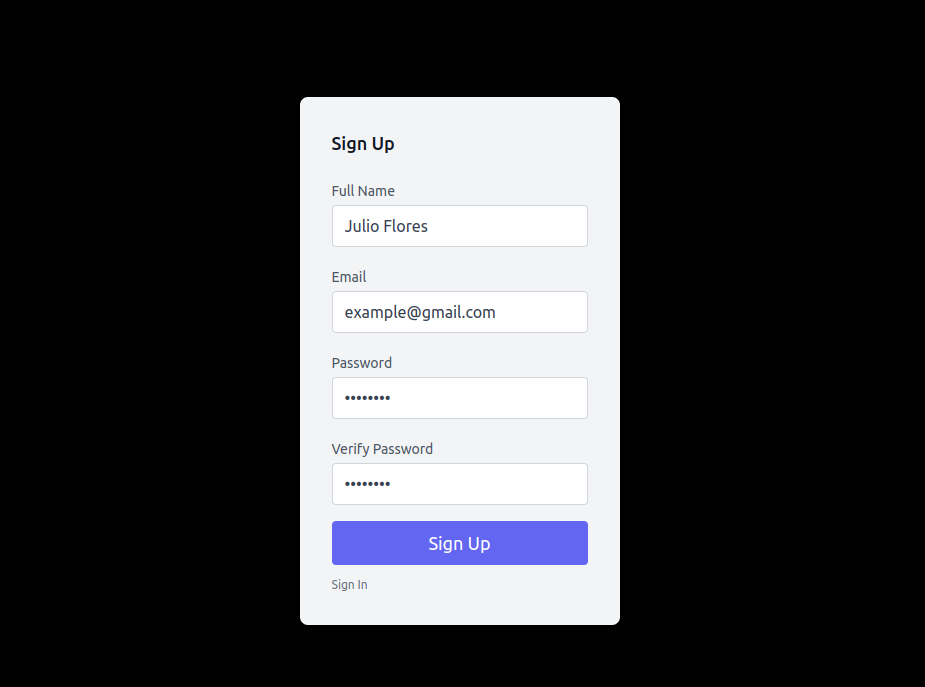
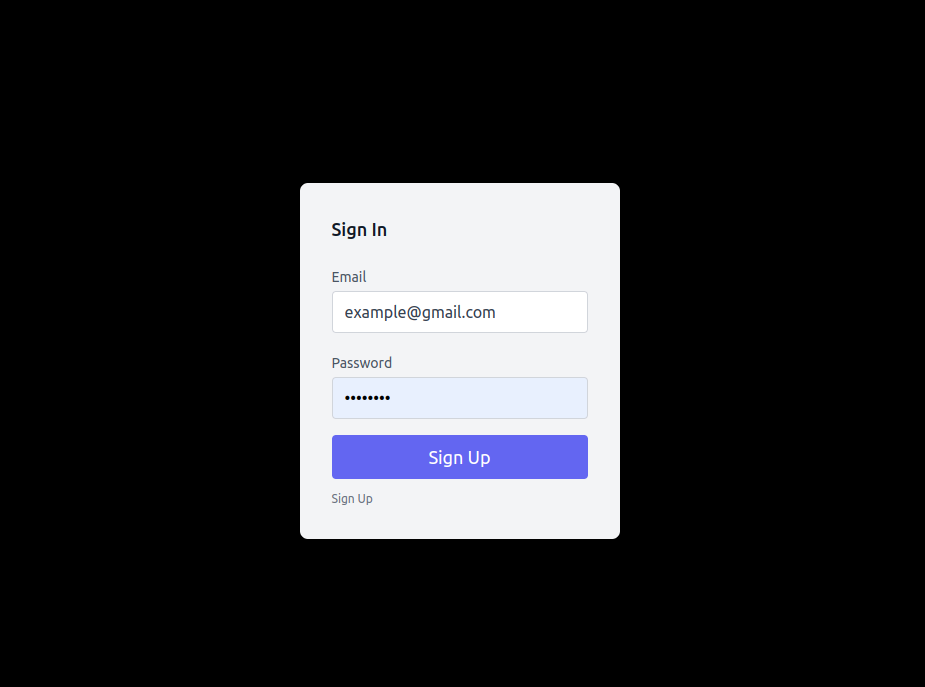
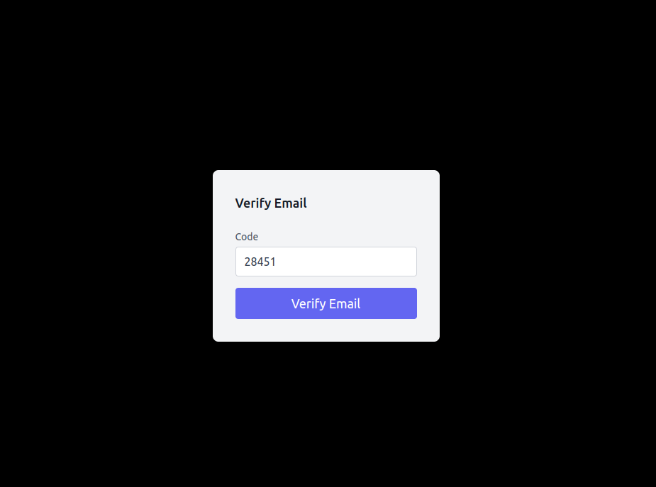
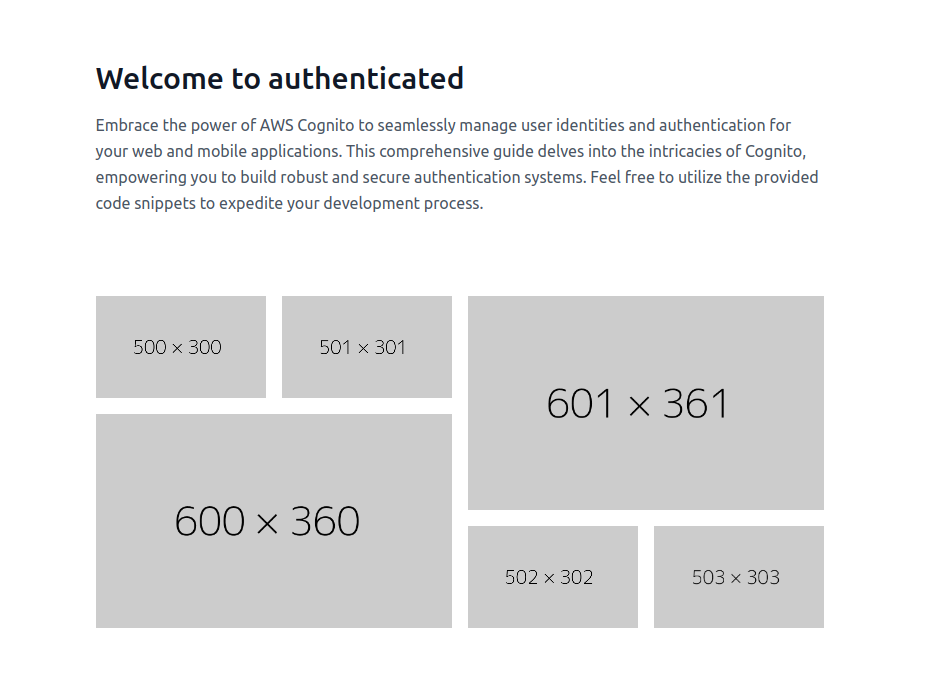

# Full React + Tailwind Authentication (AWS Cognito)

This comprehensive authentication system provides a robust foundation for managing user identities and authentication in your React applications. Feel free to reuse or learn from the provided code to streamline your development process.

## Overview

Harness the power of AWS Cognito to seamlessly integrate user authentication into your React applications. This project encompasses a complete authentication system, covering user registration, sign-in, email verification, and access-controlled pages.






## Requirements

- AWS Cognito User Pool (created in the AWS Console)
- Node.js `v18` or higher
- Yarn
- AWS Account

## Running

- Clone the repository:

```bash
git clone <url>
```

- Navigate to the project directory: cd react-tailwind-cognito

```bash
cd react-tailwind-cognito
```

- Install dependencies: yarn

```bash
yarn
```

- Start the development server: yarn start

```bash
yarn start
```

## Tech Stack

- AWS Amplify for streamlined integration with AWS Cognito
- React for building user interfaces
- React Router for managing application routes
- Tailwind CSS for rapid and responsive styling

## Additional Notes

Feel free to customize the code to suit your specific application needs.
For detailed instructions and configuration guidance, refer to the project's documentation.
